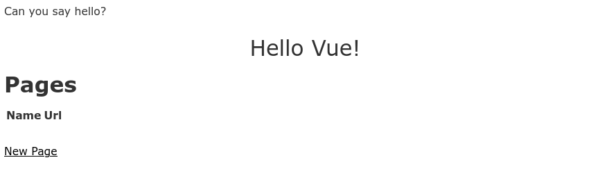

# README
This example application is based on code from the
[Vue on Rails book](https://www.amazon.com/Vue-Rails-End-End-Building/dp/1484251156) and
from their [github code repository](https://github.com/vueonrails/code-examples).
The steps are slightly modified where appropriate:
  * To account differences in Rails 6
  * Remove sprockets from the asset pipeline and use Webpacker for assets

# App Generation

1. `rails new page-specific-4.1 --webpack=vue --skip-coffee --skip-sprockets`

1. `rails g scaffold pages name:text url:text`

1. Add `vueonrails` gem to the **Gemfile**

1. `bundle install`

# Prepare Application

1. Move `scaffold.css` from **/app/assets/stylesheets** to /app/**javacript/stylesheets**.

1. Add an import statement to **/app/javascript/packs/application.js**.
   ```
   import "../stylesheets/scaffold.css
   ```
1. Add Turbo-links using the command: `yarn add vue-turbolinks`

# Hello Vue
Next we will check point our current installation by enabling the hello world
example that was automatically installed.

1. Uncomment the block of code in **/app/javascript/packs/hello_vue.js** that
   matches the block below. It should be the only uncommented code in the file.
    ```
    import TurbolinksAdapter from 'vue-turbolinks'
    import Vue from 'vue/dist/vue.esm'
    import App from '../app.vue'

    Vue.use(TurbolinksAdapter)

      document.addEventListener('turbolinks:load', () => {
        const app = new Vue({
          el: '#hello',
          data: () => {
            return {
              message: "Can you say hello?"
            }
          },
          components: { App }
        })
      })
    ```
1. Add the following lines to the `<head>` section of the layout file
   **/app/views/layouts/application.html.erb**
    ```
    <%= stylesheet_pack_tag 'application', media: 'all', 'data-turbolinks-track': 'reload' %>
    <%= javascript_pack_tag 'application', 'data-turbolinks-track': 'reload' %>
    <%= javascript_pack_tag 'hello_vue' %>
    ```
2. Add the following lines to the `<body>` section of the layout file:
    ```
    <div id='hello'>
      {{message}}
      <app></app>
    </div>
    ```
3. In one terminal window fire up the webpack server `bin/webpack-dev-server`
4. In another terminal fire up the rails server `rails s`
5. Navigate to http://localhost:3000/pages and you should see a screen that
   looks like:
   
6. Once you know Rails and Vue.js are working together you can comment out
   the code you added to the `<body>` section above.
